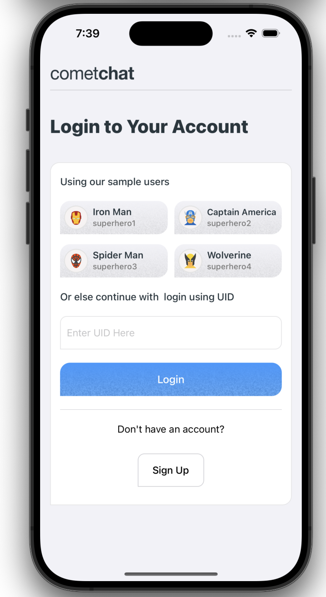

<p align="center">
  
</p>

# iOS Sample App by CometChat

This reference application showcases the integration of [**CometChat's iOS UI Kit**](https://www.cometchat.com/docs/v4/ios-uikit/overview) within an iOS framework. It provides developers with examples of implementing real-time messaging and voice and video calling features in their iOS-based applications.

## Prerequisites

- XCode 
- pod (CocoaPods)
- Sign up for a [CometChat](https://app.cometchat.com/) account to get your app credentials: _`App ID`_, _`Region`_, and _`Auth Key`_


## Installation
1. Clone the repository:
    ```
    git clone https://github.com/cometchat/cometchat-sample-app-ios.git
    ```

2. Navigate to the project directory:
    ```sh
      cd cometchat-sample-app-ios/CometChatSwift
    ```

3. Install dependencies:
    ```sh
      pod install
    ```

4. In Xcode, open the project by opening `cometchat-sample-app-ios/CometChatSwift.xcworkspace`

5. Enter your CometChat _`App ID`_, _`Region`_, and _`Auth Key`_ in the [CometChatSwift/AppConstants.swift](CometChatSwift/AppConstants.swift) file:
    ```swift
      static var APP_ID = "Enter Your App ID Here"
      static var AUTH_KEY = "Enter Your AuthKey Here"
      static var REGION = "Enter Your Region Code Here"
    ```
6. Run the app on a device or emulator.
   



## Help and Support
For issues running the project or integrating with our UI Kits, consult our [documentation](https://www.cometchat.com/docs/ios-uikit/integration) or create a [support ticket](https://help.cometchat.com/hc/en-us) or seek real-time support via the [CometChat Dashboard](http://app.cometchat.com/).
